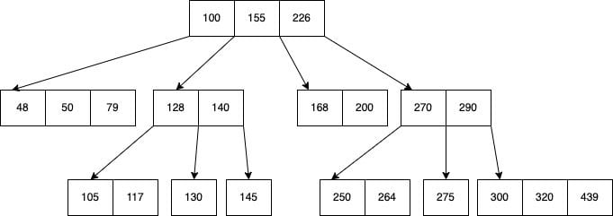

# Índices e a estrutura B-Tree

Um índice no SQL Server funciona como um índice em um livro — ajuda o SQL Server a encontrar dados rapidamente sem escanear toda a tabela.

- [B-Tree](#b-tree)
- [Índice Clustered, Non-Clustered e Heap Table](#índice-clustered-non-clustered-e-heap-table)
- [Impacto dos índices na tabela](#impacto-dos-índices-na-tabela)
- [Diferença entre Seek, Scan e Lookup](#diferença-entre-seek-scan-e-lookup)
- [Demo](#demo)

## B-Tree
Uma B-Tree é uma estrutura de dados usada para manter os dados ordenados e permitir buscas, inserções e deleções de forma eficiente.

- A árvore pode ter três níveis:
    - Root level: nível raiz da árvore, onde a busca começa.
    - Intermediate level: os níveis intermediários, podem ser vários, e funcionam apenas como ramificações com ponteiros para o último nível.
    - Leaf level: É onde os dados efetivamente estão armazenados. 
- Cada nó pode ter vários filhos.
- A árvore mantém-se balanceada automaticamente.
- Os valores estão ordenados.
- A "altura" da árvore é baixa, garantindo operações rápidas.
- Permite que operações de busca e gravação sejam executadas de forma eficiente: SELECT, UPDATE, DELETE, range scan (WHERE valor BETWEEN 10 and 50)



## Índice Clustered, Non-Clustered e Heap Table

Clustered:
- Define a ordem física dos dados na tabela.
- Só podemos ter um índice clustered por tabela.
- Os dados são armazenados efetivamente nesse índice (no nível folha / leaf).

Non-Clustered:
- Não altera a ordem física dos dados na tabela.
- Pode haver vários índices non-clustered por tabela.
- No nível folha, ele contém as colunas do índice e um ponteiro para localizar os dados reais (RID ou chave do clustered index).

| Característica             | Clustered                             | Non-Clustered                     |
|---------------------------|----------------------------------------|-----------------------------------|
| Ordenação física dos dados| Sim                                    | Não                               |
| Número permitido          | 1 por tabela                           | Vários                            |
| Armazena dados?           | Sim (no nível folha)                   | Não, apenas ponteiros             |
| Velocidade em buscas      | Muito rápido se a consulta usa a chave | Depende                           |
| Típico uso                | `PRIMARY KEY` ou `PARTITIONING`        | Consultas frequentes por colunas  |

Heap table:
- Uma tabela heap é uma tabela sem índice CLUSTERED.
- Os dados são armazenados sem uma ordem específica.
- Requer `table scan` ou `RID lookup` para encontrar dados.
- No geral, as buscas e escritas são menos eficientes.
- Quando posso usar:
    - Tabela temporária com pouca leitura e muita escrita.
    - Quando acesso via índice non-clustered for suficiente.
    - Quando a tabela for muito pequena e o scan é aceitável.

## Impacto dos índices na tabela

Em suma, um índice **otimiza consulta** porém retarda **alterações** (INSERT, UPDATE e DELETE).

- Em workloads onde a ESCRITA é high intensive, temos que ter bastante cuidado com a quantidade de índices criados em uma tabela.
- Em workloads onde a LEITURA é high intensive, termos vários índices pode ajudar bastante na performance.

## Diferença entre Seek, Scan e Lookup

Index seek:
- Busca eficiente no índice.
- O SQL Server consegue usar os critérios da WHERE para ir diretamente ao(s) valor(es) desejado(s) no índice.
- Operação muito rápida e eficiente. Ideal.
- Exemplo: `SELECT * FROM Customers WHERE customer_id = 42`

Index scan ou Table Scan:
- Leitura de todos os registros do índice ou da tabela (varredura).
- Algumas situações em que o scan pode ocorrer:
    - Quando não há um índice específico pelos campos do WHERE.
    - Quando a consulta precisa varrer muitos dados.
    - Quando a condição do filtro é muito genérica.
- Operação custosa e pode ser lenta em tabelas grandes.
- Exemplo: `SELECT * FROM Customers WHERE name LIKE 'C%'`

Key Lookup ou RID Lookup:
- Após um seek em um índice não-clusterizado, o SQL Server precisa buscar colunas adicionais fora desse índice.
- Tipos:
    - Key Lookup: Tabela com índice clusterizado.
    - RID Lookup: Tabela heap (sem índice clusterizado).
- A operação pode ser custosa se ocorrer em muitos registros.
- Exemplo: `SELECT name FROM Customers WHERE email = 'john@example.com'`.
    - Sendo que temos um índice NONCLUSTERED pelo campo `email` porém é necessário um key lookup para obter o valor do campo `name`
- Tip: Podemos reduzir a quantidade de key lookup adicionando os campos adicionais no `INCLUDE` do índice. No nosso exemplo:

```sql
CREATE NONCLUSTERED INDEX [IX_Customers_Email] ON Customers([email]) INCLUDE ([name])
GO
```

## Demo

Vamos criar uma tabela `Customers` com um índice CLUSTERED na PK e um índice NONCLUSTERED auxiliar.

```sql
CREATE DATABASE [IndexDemo]
GO
```

```sql
CREATE TABLE [Customers] (
    [customer_id] INT NOT NULL IDENTITY(1,1),
    [name] VARCHAR(100) NOT NULL,
    [email] VARCHAR(100) NOT NULL,
    [created_at] DATE DEFAULT GETDATE(),
    CONSTRAINT [PK_Customers] PRIMARY KEY CLUSTERED ([customer_id])
)
GO

CREATE NONCLUSTERED INDEX [IX_Customers_Email] ON Customers([email])
GO
```

Agora vamos inserir 10.000 registros para simular as buscas de dados:

```sql
SET NOCOUNT ON

DECLARE @i INT = 1;

WHILE @i <= 10000
BEGIN
    INSERT INTO [Customers] (name, email) VALUES (CONCAT('Customer_', @i), CONCAT('customer_', @i, '@email.com'));
    SET @i += 1;
END

SET NOCOUNT OFF
GO
```

A partir de agora você pode usar a query de [index_usage.sql](./index_usage.sql) para verificar as operações que estão acontecendo em cada índice da tabela enquanto executa uma a uma as queries abaixo.

Select que executa um `index scan` no índice CLUSTERED:
```sql
SELECT * FROM [Customers]
```

Select que executa um `index seek` no índice CLUSTERED:
```sql
SELECT * FROM Customers
WHERE customer_id = 1
```

Select que executa um `index seek` no índice NON-CLUSTERED:
```sql
SELECT customer_id, email FROM Customers
WHERE email = 'customer_1@email.com'
```

> Veja que eu consigo usar o campo customer_id e obter ele somente no índice Non-Clustered porque a PK sempre é adicionada automaticamente em todo índice Non-Clustered

Select que executa um `Index seek` no índice NON-CLUSTERED com um `Key lookup`:
```sql
SELECT * FROM Customers
WHERE email = 'customer_1@email.com'
```

Update que atualiza somente o índice CLUSTERED:
```sql
UPDATE Customers SET name = 'Customer_1_New'
WHERE customer_id = 1
```

Update que atualiza ambos índices:
```sql
UPDATE Customers SET email = 'customer_1_New@email.com'
WHERE customer_id = 1
```

Delete que atualiza ambos índices:
```sql
DELETE Customers
WHERE email = 'customer_1_New@email.com'
```

