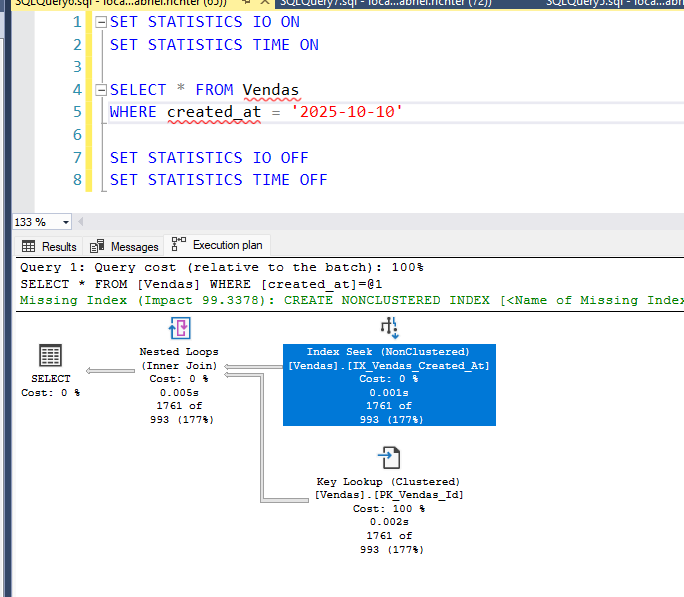
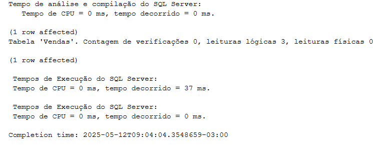

# Particionamento por data

- [Preparando o ambiente](#preparando-o-ambiente)
- [Cenário 0 - Dados não particionados](#cenário-0---dados-não-particionados)
- [Cenário 1](#cenário-1)
	- [Load](#load)
	- [Busca de dados](#busca-de-dados)
	- [Manutenção](#manutenção)
- [Cenário 2](#cenário-2)
	- [Load](#load-1)
	- [Busca de dados](#busca-de-dados-1)
	- [Manutenção](#manutenção-1)
- [Comparação entre cenários](#comparação-entre-cenários)

## Preparando o ambiente

```sql
CREATE DATABASE [LojaParticionada];
GO
```

## Cenário 0 - Dados não particionados
Inicialmente criamos uma tabela chamada **Vendas** não particionada. Nesse exemplo, estamos simulando uma PK pelo campo id e um índice NONCLUSTERED auxiliar por created_at (campo que em um cenário real poderia ser usado para um script de expurgo por exemplo).

**Vantagens**:
- Simplicidade na criação da tabela, manutenção e operação.

**Desvantagens**:
- Perda de performance e maior tempo para tarefas de manutenção a medida que a tabela cresce.


Vamos criar a tabela:
```sql
USE [LojaParticionada];
GO

CREATE TABLE [dbo].[Vendas] (
    [id] INT IDENTITY(1,1) NOT NULL,
    [cliente] VARCHAR(100) NOT NULL,
    [valor] DECIMAL(10,2) NOT NULL,
    [created_at] DATE NOT NULL
) ON [PRIMARY]
GO

-- PK
ALTER TABLE [dbo].[Vendas]
ADD CONSTRAINT [PK_Vendas_Id] PRIMARY KEY CLUSTERED ([id])
ON [PRIMARY]
GO

-- Índice auxiliar
CREATE NONCLUSTERED INDEX [IX_Vendas_Created_At] ON [dbo].[Vendas] ([created_at] ASC)
ON [PRIMARY]
GO
```


### Load
E agora vamos inserir uma massa de dados, representando 50.000 registros por mês usando essa query de [load.sql](./scripts/utils/load.sql).

> Importante alterar o nome da tabela antes de executar.

E agora usando esse [script](./scripts/utils/partitions.sql) conseguimos validar a quantidade de registros salvos em cada um dos índices. Aqui vemos claramente que toso os 600.000 registros foram salvos na mesma partição 1 do índice.

> Como estamos criando os índices sem particionamento, todos os registros são salvos em uma única estrutura binário, uma única partição.


### Busca de dados
Com essa abordagem, quanto mais registros temos na tabela, mais os índices crescerão e mais custoso será para o banco de dados realizar qualquer operação nessa massa de dados.

Operações de **index_seek** nesses dados talvez não serão tão perceptíveis, pois o banco conseguirá obter os dados de forma eficiente na maioria das vezes. Porém, operação de **key lookup** ou **index scan** podem ser bastante custosas.

Aqui temos um exemplo de uma busca pelo campo created_at. Veja que mesmo executando duas operações normalmente eficientes, que são o index_seek e o key_lookup, ainda assim, devido à quantidade total de registros, o banco precisou fazer 5.411 *logical reads*.




Lembrando que o key lookup acontece pois o index seek é feito no índice NONCLUSTERED que não possui todos os campos da projeção, e por isso ele precisa realizar um key lookup no índice CLUSTERED para buscar os dados faltantes. Em um cenário onde o filtro consegue realizar um index seek diretamente no índice CLUSTERED, essa busca será muito mais eficiente e sem muito logical reads mesmo uma tabela não particionada. Como é o exemplo que eu aplico um **filtro pelo campo id** (PK clusterizada).




### Manutenção
TO DO

## Cenário 1
Nessa abordagem criamos a **PK CLUSTERED** composta por id e created_at (onde created_at é o campo particionado). Além disso, criamos também um índice auxiliar somente por created_at, também particionado, permitindo buscas sem o id.

**Vantagens**:
- Ambos índices são particionados. Otimizando consultas da aplicação e manutenção de índice.

**Desvantagens**:
- Não temos um controle de unicidade para o campo o "id". Na prática, podemos ter dois "id" iguais desde que a created_at seja diferente.

Vamos criar a tabela:
```sql
USE [LojaParticionada];
GO

CREATE PARTITION FUNCTION [pf_VendasPorMes] (DATE)
AS RANGE RIGHT FOR VALUES (
    '2025-01-01', '2025-02-01', '2025-03-01', '2025-04-01',
    '2025-05-01', '2025-06-01', '2025-07-01', '2025-08-01',
	'2025-09-01', '2025-10-01', '2025-11-01', '2025-12-01'
);
GO

CREATE PARTITION SCHEME [ps_VendasPorMes]
AS PARTITION [pf_VendasPorMes] ALL TO ([PRIMARY]);
GO

CREATE TABLE [dbo].[Vendas_Partitioned_One] (
    [id] INT IDENTITY(1,1) NOT NULL,
    [cliente] VARCHAR(100) NOT NULL,
    [valor] DECIMAL(10,2) NOT NULL,
    [created_at] DATE NOT NULL
) ON [ps_VendasPorMes] ([created_at])
GO

-- Pk clusterizada e particionada
ALTER TABLE [dbo].[Vendas_Partitioned_One]
ADD CONSTRAINT [PK_Vendas_Partitioned_One_Id_Created_at] PRIMARY KEY CLUSTERED ([id], [created_at])
ON [ps_VendasPorMes] ([created_at])
GO

-- Índice auxiliar também particionado para permitir buscar somente por created_at
CREATE NONCLUSTERED INDEX [IX_Vendas_Partitioned_One_Created_At] ON [dbo].[Vendas_Partitioned_One] ([created_at] ASC)
ON [ps_VendasPorMes] ([created_at])
GO
```


### Load
E agora vamos inserir uma massa de dados, representando 50.000 registros por mês usando essa query de [load.sql](./scripts/utils/load.sql).

> Importante alterar o nome da tabela antes de executar.

E agora usando esse [script](./scripts/utils/partitions.sql) conseguimos validar as partições criadas para cada um dos índices e a quantidade de registros que temos em cada um. Aqui vemos claramente que temos 50.000 registros inseridos em cada uma das partições.

> A partição 1 de cada índice é criada automaticamente pelo SQL Server para os casos foram do range definido.


### Busca de dados
Com essa abordagem temos duas possibilidade de filtro WHERE para uma busca eficiente dos dados:
- usando campos id e created_at
- somente campo created_at

A busca pelos campos id e created_at irá realizar um index seek no índice clustered (que também é PK). A busca consegue executar de forma eficiente pois contém ambos campos do índice, assim conseguindo realizar a busca em uma única partição. Mesmo que a tabela tenha centenas de partições, a busca será realizada somente em uma delas.


Além disso, note que conseguimos buscar os dados de forma eficiente mesmo usando o * na projeção. Isso é possível pois como a busca está sendo realizada no índice CLUSTERED, temos todos os dados da tabela ali.

Já a busca pelo campo created_at também será eficiente, as duas diferenças principais aqui é a quantidade de registros retornada, que pode ser enorme já que eu posso ter N vendas em um mesmo dia, e também a questão da projeção. Ao contrário de um seek em um índice CLUSTERED que tem todos os dados da tabela, a busca somente pelo campo created_at está utilizando o índice NONCLUSTERED [IX_Vendas_Created_At]. Assim, dependendo dos campos adicionados na projeção o banco terá que fazer um key lookup na PK (porém mesmo assim a query será eficiente, ambas operações no plano de execução acessarão somente a partição que corresponde ao mês em questão).


**IMPORTANTE**: Nesse cenário é extremamente importante tomar cuidado com filtros somente pelo campo id. Isso acontece pois eu não tenho unicidade para o id, já que a PK é composta entre id e created_at. Por conta disso, se eu aplicar um filtro usando somente o campo id, o banco de dados terá de percorrer todas as partições.


> Note que a operação é a mesma, index seek, porém agora percorrendo todas as 13 partições do índice ao invés de percorrer somente uma.

Essa diferença fica ainda mais clara olhando para as métricas de logical reads e scan count quando executo a query buscando somente por id ou buscando por id e created_at.


### Manutenção
TO DO

## Cenário 2
Nessa abordagem criamos o índice CLUSTERED particionado por id e created_at porém sem ser PRIMARY KEY. E criamos a PRIMARY KEY como NONCLUSTERED, para garantir unicidade, porém sem adicionar ao particionamento.

**Vantagens**:
- Conseguimos garantir unicidade do campo "id". Isso pode ser útil por exemplo caso a PK fosse CPF.

**Desvantagens**:
- A PK, como não é particionada, crescerá cada vez mais conforme a tabela também aumentar. Quanto maior a tabela mais custoso será percorrer esse índice em consultas ou mesmo em tarefas de de índice (reorganize e rebuild).

Vamos criar a tabela:
```sql

USE [LojaParticionada];
GO

CREATE PARTITION FUNCTION [pf_VendasPorMes] (DATE)
AS RANGE RIGHT FOR VALUES (
    '2025-01-01', '2025-02-01', '2025-03-01', '2025-04-01',
    '2025-05-01', '2025-06-01', '2025-07-01', '2025-08-01',
	'2025-09-01', '2025-10-01', '2025-11-01', '2025-12-01'
);
GO

CREATE PARTITION SCHEME [ps_VendasPorMes]
AS PARTITION [pf_VendasPorMes] ALL TO ([PRIMARY]);
GO

CREATE TABLE [dbo].[Vendas_Partitioned_Two] (
    [id] INT IDENTITY(1,1) NOT NULL,
    [cliente] VARCHAR(100) NOT NULL,
    [valor] DECIMAL(10,2) NOT NULL,
    [created_at] DATE NOT NULL
) ON [ps_VendasPorMes] ([created_at])
GO

-- Índice clusterizado e particionado
CREATE CLUSTERED INDEX [IX_Vendas_Partitioned_Two_Id_Created_At] ON [dbo].[Vendas_Partitioned_Two] ([id], [created_at])
ON [ps_VendasPorMes]([created_at])
GO

-- Índice UNIQUE somente para evitar duplicidade
ALTER TABLE [dbo].[Vendas_Partitioned_Two] ADD CONSTRAINT [PK_Vendas_Partitioned_Two_Id] PRIMARY KEY NONCLUSTERED ([id] ASC)
ON [PRIMARY]
GO
```


### Load
E agora vamos inserir uma massa de dados nessa tabela, tal qual fizemos no cenário 1 (50K registros por mês).

Veja que neste cenário, diferentemente do cenário anterior, o índice NONCLUSTERED da PK não é particionado. Por isso, enquanto o índice clustered possui 50.000 registros em cada partição, o índice da PK possui uma única partição com todos os 600.000 registros.ram do range definido.


### Busca de dados
TO DO

### Manutenção
TO DO

## Comparação entre cenários
TO DO

Principal vantagem na busca, operações de index scan serão mais rápidas no particionamento quando feitas em uma única partição.

