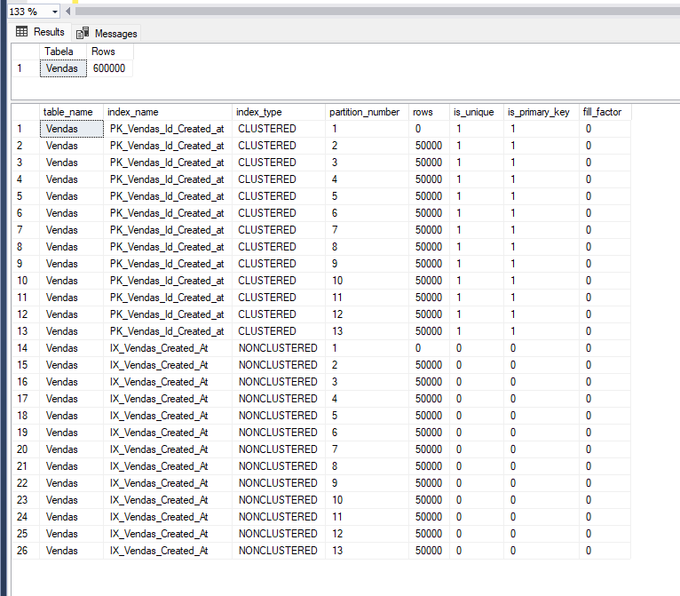

# Particionamento na prática

## Preparando o ambiente

```sql
CREATE DATABASE [LojaParticionada];
GO
```

## Cenário 1
Nessa abordagem criamos a **PK CLUSTERED** composta por id e created_at (onde created_at é o campo particionado). Além disso, criamos também um índice auxiliar somente por created_at, também particionado, permitindo buscas sem o id.

**Vantagens**:
- Ambos índices são particionados. Otimizando consultas da aplicação e manutenção de índice.

**Desvantagens**:
- Não temos um controle de unicidade para o campo o "id". Na prática, podemos ter dois "id" iguais desde que a created_at seja diferente.

Vamos criar a tabela:
```sql
USE [LojaParticionada];
GO

CREATE PARTITION FUNCTION [pf_VendasPorMes] (DATE)
AS RANGE RIGHT FOR VALUES (
    '2025-01-01', '2025-02-01', '2025-03-01', '2025-04-01',
    '2025-05-01', '2025-06-01', '2025-07-01', '2025-08-01',
	'2025-09-01', '2025-10-01', '2025-11-01', '2025-12-01'
);
GO

CREATE PARTITION SCHEME [ps_VendasPorMes]
AS PARTITION [pf_VendasPorMes] ALL TO ([PRIMARY]);
GO

CREATE TABLE [dbo].[Vendas] (
    [id] INT IDENTITY(1,1) NOT NULL,
    [cliente] VARCHAR(100) NOT NULL,
    [valor] DECIMAL(10,2) NOT NULL,
    [created_at] DATE NOT NULL
) ON [ps_VendasPorMes] ([created_at])
GO

-- Pk clusterizada e particionada
ALTER TABLE [dbo].[Vendas]
ADD CONSTRAINT [PK_Vendas_Id_Created_at] PRIMARY KEY CLUSTERED ([id], [created_at])
ON [ps_VendasPorMes] ([created_at])
GO

-- Índice auxiliar também particionado para permitir buscar somente por created_at
CREATE NONCLUSTERED INDEX [IX_Vendas_Created_At] ON [dbo].[Vendas] ([created_at] ASC)
ON [ps_VendasPorMes] ([created_at])
GO
```


### Load
E agora vamos inserir uma massa de dados, representando 50K registros por mês.
```sql
SET NOCOUNT ON

DECLARE @RowsPerMonth AS INT = 50000
DECLARE @Month AS INT = 1
DECLARE @CurrentRow AS INT

WHILE @Month <= 12
BEGIN
	PRINT CONCAT('Inserindo ', @RowsPerMonth, ' linhas para o mês ', @Month, '/2025')

	SET @CurrentRow = 1  -- reset before each month
	WHILE @CurrentRow <= @RowsPerMonth
	BEGIN
		INSERT INTO [dbo].[Vendas] (cliente, valor, created_at)
		VALUES (
			CONCAT('Cliente_', ABS(CHECKSUM(NEWID())) % 100000), -- nome aleatório
			CAST(RAND(CHECKSUM(NEWID())) * (1000 - 10) + 10 AS DECIMAL(10,2)), -- valor aleatório
			DATEADD(DAY, ABS(CHECKSUM(NEWID())) % 28, DATEFROMPARTS(2025, @Month, 1)) -- data no mês
		)
		SET @CurrentRow += 1
	END

	SET @Month += 1	

END

SET NOCOUNT OFF
GO

-- Verificar
SELECT MONTH(created_at) AS Mes, COUNT(*) AS Inseridos
FROM Vendas
GROUP BY MONTH(created_at)
ORDER BY Mes
GO
```

E agora usando esse [script](./scripts/utils/partitions.sql) conseguimos validar as partições criadas para cada um dos índices e a quantidade de registros que temos em cada um. Aqui vemos claramento que temos 50.000 registros inseridos em cada uma das partições.

> A partição 1 de cada índice é criada automaticamente pelo SQL Server para os casos foram do range definido.



### Busca de dados
Com essa abordagem temos duas possibilidade de filtro WHERE para uma busca eficiente dos dados:
- usando campos id e created_at
- somente campo created_at

A busca pelos campos id e created_at irá realizar um index seek no índice clustered (que também é PK). A busca consegue executar de forma eficiente pois contém ambos campos do índice, assim conseguindo realizar a busca em uma única partição. Mesmo que a tabela tenha centenas de partições, a busca será realizada somente em uma delas.


Além disso, note que conseguimos buscar os dados de forma eficiente mesmo usando o * na projeção. Isso é possível pois como a busca está sendo realizada no índice CLUSTERED, temos todos os dados da tabela ali.

Já a busca pelo campo created_at também será eficiente, as duas diferenças principais aqui é a quantidade de registros retornada, que pode ser enorme já que eu posso ter N vendas em um mesmo dia, e também a questão da projeção. Ao contrário de um seek em um índice CLUSTERED que tem todos os dados da tabela, a busca somente pelo campo created_at está utilizando o índice NONCLUSTERED [IX_Vendas_Created_At]. Assim, dependendo dos campos adicionados na projeção o banco terá que fazer um key lookup na PK (porém mesmo assim a query será eficiente, ambas operações no plano de execução acessarão somente a partição que corresponde ao mês em questão).


**IMPORTANTE**: Nesse cenário é extremamente importante tomar cuidado com filtros somente pelo campo id. Isso acontece pois eu não tenho unicidade para o id, já que a PK é composta entre id e created_at. Por conta disso, se eu aplicar um filtro usando somente o campo id, o banco de dados terá de percorrer todas as partições.


> Note que a operação é a mesma, index seek, porém agora percorrendo todas as 13 partições do índice ao invés de percorrer somente uma.

Essa diferença fica ainda mais clara olhando para as métricas de logical reads e scan count quando executo a query buscando somente por id ou buscando por id e created_at.


## Cenário 2
Nessa abordagem criamos o índice CLUSTERED particionado por id e created_at porém sem ser PRIMARY KEY. E criamos a PRIMARY KEY como NONCLUSTERED, para garantir unicidade, porém sem adicionar ao particionamento.

**Vantagens**:
- Conseguimos garantir unicidade do campo "id". Isso pode ser útil por exemplo caso a PK fosse CPF.

**Desvantagens**:
- A PK, como não é particionada, crescerá cada vez mais conforme a tabela também aumentar. Quanto maior a tabela mais custoso será percorrer esse índice em consultas ou mesmo em tarefas de de índice (reorganize e rebuild).

Vamos criar a tabela:
```sql

USE [LojaParticionada];
GO

CREATE PARTITION FUNCTION [pf_VendasPorMes] (DATE)
AS RANGE RIGHT FOR VALUES (
    '2025-01-01', '2025-02-01', '2025-03-01', '2025-04-01',
    '2025-05-01', '2025-06-01', '2025-07-01', '2025-08-01',
	'2025-09-01', '2025-10-01', '2025-11-01', '2025-12-01'
);
GO

CREATE PARTITION SCHEME [ps_VendasPorMes]
AS PARTITION [pf_VendasPorMes] ALL TO ([PRIMARY]);
GO

CREATE TABLE [dbo].[Vendas_2] (
    [id] INT IDENTITY(1,1) NOT NULL,
    [cliente] VARCHAR(100) NOT NULL,
    [valor] DECIMAL(10,2) NOT NULL,
    [created_at] DATE NOT NULL
) ON [ps_VendasPorMes] ([created_at])
GO

-- Índice clusterizado e particionado
CREATE CLUSTERED INDEX [IX_Vendas_2_Id_Created_At] ON [dbo].[Vendas_2] ([id], [created_at])
ON [ps_VendasPorMes]([created_at])
GO

-- Índice UNIQUE somente para evitar duplicidade
ALTER TABLE [dbo].[Vendas_2] ADD CONSTRAINT [PK_Vendas_2_Id] PRIMARY KEY NONCLUSTERED ([id] ASC)
ON [PRIMARY]
GO
```


### Load
E agora vamos inserir uma massa de dados nessa tabela, tal qual fizemos no cenário 1 (50K registros por mês).

Veja que neste cenário, diferentemente do cenário anterior, o índice NONCLUSTERED da PK não é particionado. Por isso, enquanto o índice clustered possui 50.000 registros em cada partição, o índice da PK possui uma única partição com todos os 600.000 registros.ram do range definido.


### Busca de dados
TO DO
