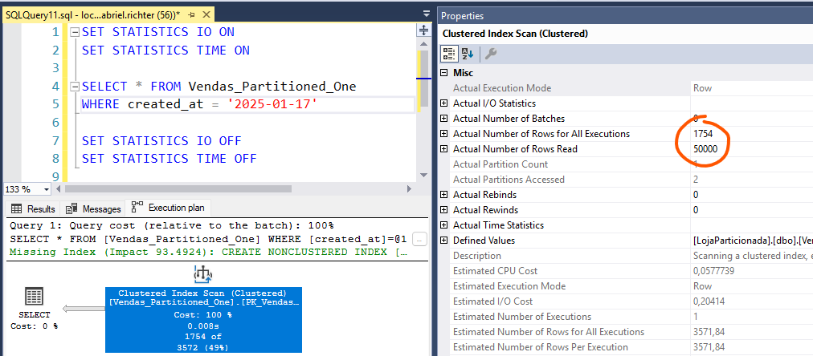
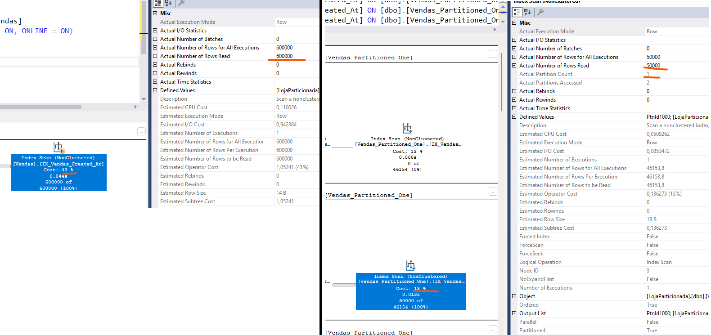

# Particionamento por data

- [Cenários](#cenários)
- [Preparando o ambiente](#preparando-o-ambiente)
- [Teste de busca de dados](#teste-de-busca-de-dados)
- [Manutenção de índices](#manutenção-de-índices)
- [House Keeping e arquivamento](#house-keeping-e-arquivamento)
- [Adicionando novas partições](#adicionando-novas-partições)
- [Comparação entre cenários](#comparação-entre-cenários)

## Cenários

Estamos simulando um **Sistema de Vendas**. Nesse sentido, a maioria das buscas e controles se dá pelo escopo de data da venda. Nesse caso, a maioria das queries performadas no banco de dados usa o campo de **created_at** na sua busca.

| Cenário | Características | Índices |
| ------- | --------------- | ------- |
| 0 | Índices não particionados | PK_Vendas_Id (Clustered, Unique) e IX_Vendas_Created_At (Non-Clustered, Non-Unique) |
| 1 | Índices particionados | PK_Vendas_Partitioned_One_Id_Created_at (Clustered, Unique) e IX_Vendas_Partitioned_One_Created_At(Non-Clustered, Non-Unique) |
| 2 | Índice clustered particionado e PK não particionada | PK_Vendas_Partitioned_Two_Id (Non-Clustered, Unique) e IX_Vendas_Partitioned_Two_Id_Created_At (Clustered) |


## Preparando o ambiente

```sql
CREATE DATABASE [LojaParticionada];
GO
```

### Cenário 0
Inicialmente criamos uma tabela chamada **Vendas** não particionada. Nesse exemplo, estamos simulando uma PK pelo campo id e um índice NONCLUSTERED auxiliar por created_at (campo que em um cenário real poderia ser usado para um script de expurgo por exemplo).

**Passos**:
- Criar a tabela: [ddl.sql](./scenario_0/ddl.sql)

- Inserir massa de dados: 50.000 registros em cada mês = 600.000 registros ao total de um ano: [load.sql](./scenario_0/load.sql)

Como estamos criando os índices sem particionamento, todos os registros são salvos em uma única estrutura binário, uma única partição.


### Cenário 1
Nessa abordagem criamos a **PK CLUSTERED** composta por id e created_at (onde created_at é o campo particionado). Além disso, criamos também um índice auxiliar somente por created_at, também particionado, permitindo buscas sem o id.

**Passos**:
- Criar a tabela: [ddl.sql](./scenario_1/ddl.sql)

- Inserir massa de dados: 50.000 registros em cada mês = 600.000 registros ao total de um ano: [load.sql](./scenario_1/load.sql)

Como estamos criando ambos índices particionados, vemos que cada partição recebeu o equivalente às 50.000 linhas do mês.


### Cenário 2
Nessa abordagem criamos o índice CLUSTERED particionado por id e created_at porém sem ser PRIMARY KEY. E criamos a PRIMARY KEY como NONCLUSTERED, para garantir unicidade, porém sem adicionar ao particionamento.

**Passos**:
- Criar a tabela: [ddl.sql](./scenario_2/ddl.sql)

- Inserir massa de dados: 50.000 registros em cada mês = 600.000 registros ao total de um ano: [load.sql](./scenario_2/load.sql)

Como estamos criando o índice clustered particionado mas a PK não, vemos que para o índice particionado temos 50.000 registros em cada partição, porém a PK não particionada recebe todas as 600.000 linhas.


## Teste de busca de dados

### Cenário 0

Com essa abordagem, quanto mais registros temos na tabela, mais os índices crescerão e mais custoso será para o banco de dados realizar operações de leitura.

Operações de **index_seek** nesses dados talvez não serão tão perceptíveis, pois o banco conseguirá obter os dados de forma eficiente na maioria das vezes. Porém, as operações de **index scan** podem ser bastante custosas.

Aqui temos um exemplo de uma busca pelo campo created_at. Veja que mesmo executando duas operações normalmente eficientes, que são o index_seek e o key_lookup, ainda assim, devido à quantidade total de registros, o banco precisou fazer 5.411 *logical reads*.


Lembrando que o key lookup acontece pois o index seek é feito no índice NONCLUSTERED que não possui todos os campos da projeção, e por isso ele precisa realizar um key lookup no índice CLUSTERED para buscar os dados faltantes. Em um cenário onde o filtro consegue realizar um index seek diretamente no índice CLUSTERED, essa busca será muito mais eficiente mesmo para essa tabela não particionada. Conforme exemplo abaixo filtrando pelo campo id (PK clusterizada).


### Cenário 1
Com essa abordagem temos duas possibilidade de filtro WHERE para uma busca eficiente dos dados:
- usando campos id e created_at
- somente campo created_at

A busca pelos campos **id e created_at** irá realizar um index seek no índice clustered (que também é PK). A busca consegue executar de forma eficiente pois contém ambos campos do índice, assim conseguindo realizar a busca em uma única partição. Mesmo que a tabela tenha dezenas de partições, a busca será realizada somente em uma delas.


Além disso, note que conseguimos buscar os dados de forma eficiente mesmo usando o * na projeção. Isso é possível pois como a busca está sendo realizada no índice CLUSTERED, temos os dados do nível folha no mesmo índice.

Já a busca pelo campo **created_at** também será relativamente eficiente. Note que como podemos ter N registros para um mesmo created_at, tem uma grande possibilidade do banco realizar um index scan para essa busca. A vantagem aqui é que como o índice é particionado e estamos buscando por um único dia, o SQL Server irá varrer uma única partição (nesse exemplo varrendo 50.000 registros ao invés dos 600.000 que existem em toda a tabela).



**IMPORTANTE**: Nesse cenário é extremamente importante tomar cuidado com filtros somente pelo campo id. Isso acontece pois o particionamento é feito pela composição dos campos id e created_at, assim, quando eu realizo uma busca somente pelo campo id o banco precisa percorrer todas as partições (já que o id pode existir em uma ou mais partições).


Note que a operação é a mesma, index seek, porém agora ela percorre todas as 13 partições do índice. Isso indica que não é porque a operação é um index seek que ela está otimizada da melhor forma possível. Essa diferença fica ainda mais clara olhando para as métricas de logical reads e scan count quando executo a query buscando somente por id ou buscando por id e created_at.


### Cenário 2

Note que apesar da mudança na estrutura dos índices entre o cenário 1 e o cenário 2, a forma que o SQL Server trata cada busca de dados se mantém praticamente a mesma.

A busca pelos campos **id e created_at** é tão eficiente quanto no Cenário 1.


A busca por **created_at** também tem um comportamento parecido de index scan.


Uma **pequena diferença** nesse cenário é na busca pelo campo **id**.

Aqui, dependendo da quantidade de registros, o banco pode escolher por fazer um index seek no índice CLUSTERIZADO e varrer todas as partições (tal qual feito no cenário 1).


... ou o SQL Server pode escolher o índice da PK NONCLUSTERED para fazer o filtro. Caso isso aconteça, será feita uma operação de index seek na PK e um Key Lookup com o índice CLUSTERED.


> A busca por id usando a PK não necessariamente será melhor que a primeira opção, porém o interessante aqui é que o SQL Server terá esse recurso caso necessário.


## Manutenção de índices

A manutenção dos índices, reorganize/rebuild, pode ser feita por partição (quando existe particionamento). Caso não exista particionamento, todo o índice precisa ser percorrido para realizar esta operação.

### Cenário 0

Como a tabela deste cenário não é particionada, a tarefa de REORGANIZE/REBUILD precisa reescrever/varrer todo o índice (quanto maior o índice, mais demorado e custoso será o processo).


```sql
ALTER INDEX [IX_Vendas_Created_At] ON [dbo].[Vendas]
REBUILD WITH (FILLFACTOR = 90, SORT_IN_TEMPDB = ON, ONLINE = ON)
GO
```


Aqui podemos ver também que o index scan realizado teve que ler todos os 600.000 registros da tabela (quanto maior a tabela, mais lento será a operação).


> Note também que como nós particionamos os dois índices da tabela, o mesmo que acontece com o índice *IX_Vendas_Partitioned_One_Created_At* pode ser aplicado também ao índice *PK_Vendas_Partitioned_One_Id_Created_at*.

### Cenário 1

Já no caso de uma tabela com os índices particionados, podemos ver somente uma fração dos registros em cada partição. Isso significa também que podemos realizar o REBUILD ou o REORGANIZE de uma única partição, ou em todas, conforme necessidade.


Aqui temos os comandos para realizar o REBUILD em cada uma das partições.

```sql
ALTER INDEX [IX_Vendas_Partitioned_One_Created_At] ON [dbo].[Vendas_Partitioned_One] REBUILD PARTITION = 1 WITH (SORT_IN_TEMPDB = ON, ONLINE = ON)
ALTER INDEX [IX_Vendas_Partitioned_One_Created_At] ON [dbo].[Vendas_Partitioned_One] REBUILD PARTITION = 2 WITH (SORT_IN_TEMPDB = ON, ONLINE = ON)
ALTER INDEX [IX_Vendas_Partitioned_One_Created_At] ON [dbo].[Vendas_Partitioned_One] REBUILD PARTITION = 3 WITH (SORT_IN_TEMPDB = ON, ONLINE = ON)
ALTER INDEX [IX_Vendas_Partitioned_One_Created_At] ON [dbo].[Vendas_Partitioned_One] REBUILD PARTITION = 4 WITH (SORT_IN_TEMPDB = ON, ONLINE = ON)
ALTER INDEX [IX_Vendas_Partitioned_One_Created_At] ON [dbo].[Vendas_Partitioned_One] REBUILD PARTITION = 5 WITH (SORT_IN_TEMPDB = ON, ONLINE = ON)
ALTER INDEX [IX_Vendas_Partitioned_One_Created_At] ON [dbo].[Vendas_Partitioned_One] REBUILD PARTITION = 6 WITH (SORT_IN_TEMPDB = ON, ONLINE = ON)
ALTER INDEX [IX_Vendas_Partitioned_One_Created_At] ON [dbo].[Vendas_Partitioned_One] REBUILD PARTITION = 7 WITH (SORT_IN_TEMPDB = ON, ONLINE = ON)
ALTER INDEX [IX_Vendas_Partitioned_One_Created_At] ON [dbo].[Vendas_Partitioned_One] REBUILD PARTITION = 8 WITH (SORT_IN_TEMPDB = ON, ONLINE = ON)
ALTER INDEX [IX_Vendas_Partitioned_One_Created_At] ON [dbo].[Vendas_Partitioned_One] REBUILD PARTITION = 9 WITH (SORT_IN_TEMPDB = ON, ONLINE = ON)
ALTER INDEX [IX_Vendas_Partitioned_One_Created_At] ON [dbo].[Vendas_Partitioned_One] REBUILD PARTITION = 10 WITH (SORT_IN_TEMPDB = ON, ONLINE = ON)
ALTER INDEX [IX_Vendas_Partitioned_One_Created_At] ON [dbo].[Vendas_Partitioned_One] REBUILD PARTITION = 11 WITH (SORT_IN_TEMPDB = ON, ONLINE = ON)
ALTER INDEX [IX_Vendas_Partitioned_One_Created_At] ON [dbo].[Vendas_Partitioned_One] REBUILD PARTITION = 12 WITH (SORT_IN_TEMPDB = ON, ONLINE = ON)
ALTER INDEX [IX_Vendas_Partitioned_One_Created_At] ON [dbo].[Vendas_Partitioned_One] REBUILD PARTITION = 13 WITH (SORT_IN_TEMPDB = ON, ONLINE = ON)
```

Note que ao executar os comandos acima temos um tempo de execução para cada partição do que comparado com o exemplo do índice não particionado.


Veja também que o REBUILD de cada partição é muito mais eficiente, sendo mais rápido e necessitando de menos logical reads comparado ao rebuild de todo o índice.

Além disso, analisando o plano de execução vemos que o index scan performado acessa somente a partição desejada, assim, varrendo uma quantidade menor de registros e tendo um custo menor.



> Note também que como nós particionamos os dois índices da tabela, o mesmo que acontece com o índice *IX_Vendas_Partitioned_One_Created_At* pode ser aplicado também ao índice *PK_Vendas_Partitioned_One_Id_Created_at*.


### Cenário 2

Comparando cenário 2 com cenário 1, a manutenção do índice CLUSTERED permanece a mesma.

Isso porque o índice está particionada da mesma forma em ambos cenários. A grande diferença está no índice da PK, que neste cenário não está particionado.


```sql
ALTER INDEX [IX_Vendas_Partitioned_Two_Id_Created_At] ON [dbo].[Vendas_Partitioned_Two] REBUILD PARTITION = 1 WITH (SORT_IN_TEMPDB = ON, ONLINE = ON)
ALTER INDEX [IX_Vendas_Partitioned_Two_Id_Created_At] ON [dbo].[Vendas_Partitioned_Two] REBUILD PARTITION = 2 WITH (SORT_IN_TEMPDB = ON, ONLINE = ON)
ALTER INDEX [IX_Vendas_Partitioned_Two_Id_Created_At] ON [dbo].[Vendas_Partitioned_Two] REBUILD PARTITION = 3 WITH (SORT_IN_TEMPDB = ON, ONLINE = ON)
ALTER INDEX [IX_Vendas_Partitioned_Two_Id_Created_At] ON [dbo].[Vendas_Partitioned_Two] REBUILD PARTITION = 4 WITH (SORT_IN_TEMPDB = ON, ONLINE = ON)
ALTER INDEX [IX_Vendas_Partitioned_Two_Id_Created_At] ON [dbo].[Vendas_Partitioned_Two] REBUILD PARTITION = 5 WITH (SORT_IN_TEMPDB = ON, ONLINE = ON)
ALTER INDEX [IX_Vendas_Partitioned_Two_Id_Created_At] ON [dbo].[Vendas_Partitioned_Two] REBUILD PARTITION = 6 WITH (SORT_IN_TEMPDB = ON, ONLINE = ON)
ALTER INDEX [IX_Vendas_Partitioned_Two_Id_Created_At] ON [dbo].[Vendas_Partitioned_Two] REBUILD PARTITION = 7 WITH (SORT_IN_TEMPDB = ON, ONLINE = ON)
ALTER INDEX [IX_Vendas_Partitioned_Two_Id_Created_At] ON [dbo].[Vendas_Partitioned_Two] REBUILD PARTITION = 8 WITH (SORT_IN_TEMPDB = ON, ONLINE = ON)
ALTER INDEX [IX_Vendas_Partitioned_Two_Id_Created_At] ON [dbo].[Vendas_Partitioned_Two] REBUILD PARTITION = 9 WITH (SORT_IN_TEMPDB = ON, ONLINE = ON)
ALTER INDEX [IX_Vendas_Partitioned_Two_Id_Created_At] ON [dbo].[Vendas_Partitioned_Two] REBUILD PARTITION = 10 WITH (SORT_IN_TEMPDB = ON, ONLINE = ON)
ALTER INDEX [IX_Vendas_Partitioned_Two_Id_Created_At] ON [dbo].[Vendas_Partitioned_Two] REBUILD PARTITION = 11 WITH (SORT_IN_TEMPDB = ON, ONLINE = ON)
ALTER INDEX [IX_Vendas_Partitioned_Two_Id_Created_At] ON [dbo].[Vendas_Partitioned_Two] REBUILD PARTITION = 12 WITH (SORT_IN_TEMPDB = ON, ONLINE = ON)
ALTER INDEX [IX_Vendas_Partitioned_Two_Id_Created_At] ON [dbo].[Vendas_Partitioned_Two] REBUILD PARTITION = 13 WITH (SORT_IN_TEMPDB = ON, ONLINE = ON)
```

Como a PK não está particionada, caso um REBUILD/REORGANIZE seja necessário, o SQL Server precisa percorrer todo o índice tal qual no cenário 0.

```sql
ALTER INDEX [PK_Vendas_Partitioned_Two_Id] ON [dbo].[Vendas_Partitioned_Two] REBUILD WITH (SORT_IN_TEMPDB = ON, ONLINE = ON)
```


## House Keeping e arquivamento

O processo de house keeping ou arquivamento dos dados para o nosso cenário, pode ser tratada pelo próprio campo **created_at**.

### Cenário 0
Para um **expurgo de dados**, uma estratégia de DELETE pode ser aplicado. Contudo, esse processo pode ser lento dependendo da quantidade de registros. Quanto mais registros, mais lento será o processo. Além disso, esse processo acaba fragmentando os índices, usa bastante o arquivo de log além de realizar lock (podendo afetar desempenho da aplicação).

```sql
DELETE FROM Vendas WHERE created_at <= '2025-01-31'
```

Quanto à **arquivamento**, uma estratégia com o uso de CRUD, assim como o expurgo, também precisa ser adotada. Nesse caso, podendo ter um INSERT a partir de um SELECT de uma tabela para outra.

```sql
INSERT INTO Vendas_Historico
SELECT cliente, valor, created_at FROM Vendas WHERE created_at <= '2025-01-31'
```

> Ou ainda uma estratégia usando [MERGE](https://learn.microsoft.com/pt-br/sql/t-sql/statements/merge-transact-sql?view=sql-server-ver16) poderia ser usada.

De toda forma, ambas abordagens ficam mais lentas conforme a quantidade de dados aumenta.

### Cenário 1 e 2
Já para os cenários com particionamento, a estratégia de **expurgo de dados** e **arquivamento** pode ser realizada através de um comando DDL que basicamente move a partição de uma tabela para outra.

Para isso, você precisa de uma tabela secundário com a mesma estrutura da tabela original. Portanto, criei uma nova tabela com a mesma estrutura e os mesmos índices da **Vendas_Partitioned_One**, porém com o nome **Vendas_Partitioned_One_Purge** ([ddl.sql](./scenario_1/ddl.sql)).

Tendo a tabela nova criada você pode mover uma determinada partição da tabela original para a tabela auxiliar. Esse comando é praticamente instantâneo independentemente da quantidade de registros.

```sql
ALTER TABLE [Vendas_Partitioned_One]
SWITCH PARTITION 2 TO [Vendas_Partitioned_One_Purge] PARTITION 2
```

Feito isso, você tem pode decidir se quer manter os dados na tabela **Vendas_Partitioned_One_Purge** por questão de histórico ou se quer expurgar. Se optar pelo expurgo, uma alternativa é utilizar um simples TRUNCATE TABLE:

```sql
TRUNCATE TABLE [Vendas_Partitioned_One_Purge]
GO
```

Note aqui que a grande diferença entre tabela particionada e não particionada para questão de arquivamento e expurgo de dados é que tabela não particionada se usa muito comandos DML enquanto que no cenário particionado usamos basicamente DDL (mais eficiente).

## Adicionando novas partições
Podemos adicionar novas partições de duas forma:
- ONLINE
- OFFLINE

**ONLINE**
Para possibilitar a execução da forma online, o PARTITION SCHEMA deve ter slots disponíveis apontando para filegroup. Nesse caso, baseado no exemplo do partition function abaixo

```sql
CREATE PARTITION FUNCTION [pf_VendasPorMes] (DATE)
AS RANGE RIGHT FOR VALUES (
    '2025-01-01', '2025-02-01', '2025-03-01', '2025-04-01',
    '2025-05-01', '2025-06-01', '2025-07-01', '2025-08-01',
	'2025-09-01', '2025-10-01', '2025-11-01', '2025-12-01'
)
GO
```

... podemos executar o comando abaixo de forma ONLINE para adicionar a nova partição sem impactar o correto funcionamento do banco de dados:

```sql
ALTER PARTITION FUNCTION pf_VendasPorMes() SPLIT RANGE ('2026-01-01')
```

**OFFLINE**
Pode ser que não tenhamos slots suficientes no PARTITION SCHEMA. Se isso acontecer, a única forma de criar novas partições é criar uma nova tabela, partition schema e partition function e migrar os dados. Mas não se desespere, com a alternativa do SWITCH PARTITION esse processo é bastante rápido de realizar com um downtime mínimo.

Imagine então que a gente crie uma nova PARTITION FUNCTION adicionando também todos os meses de 2026 (além dos já existentes de 2025). Também criamos uma PARTITION SCHEMA para acomodar essas partições. Agora criamos a tabela **Vendas_Partitioned_One_New** com a mesma estrutura da original porém usando o partition schema e partition function novo.

Agora, com a aplicação parada, nós movemos todas as partições atuais para a nova tabela e ao final renomeamos a tabela:

```sql
ALTER TABLE [Vendas_Partitioned_One] SWITCH PARTITION 1 TO [Vendas_Partitioned_One_New] PARTITION 1
ALTER TABLE [Vendas_Partitioned_One] SWITCH PARTITION 2 TO [Vendas_Partitioned_One_New] PARTITION 2
ALTER TABLE [Vendas_Partitioned_One] SWITCH PARTITION 3 TO [Vendas_Partitioned_One_New] PARTITION 3
ALTER TABLE [Vendas_Partitioned_One] SWITCH PARTITION 4 TO [Vendas_Partitioned_One_New] PARTITION 4
ALTER TABLE [Vendas_Partitioned_One] SWITCH PARTITION 5 TO [Vendas_Partitioned_One_New] PARTITION 5
ALTER TABLE [Vendas_Partitioned_One] SWITCH PARTITION 6 TO [Vendas_Partitioned_One_New] PARTITION 6
ALTER TABLE [Vendas_Partitioned_One] SWITCH PARTITION 7 TO [Vendas_Partitioned_One_New] PARTITION 7
ALTER TABLE [Vendas_Partitioned_One] SWITCH PARTITION 8 TO [Vendas_Partitioned_One_New] PARTITION 8
ALTER TABLE [Vendas_Partitioned_One] SWITCH PARTITION 9 TO [Vendas_Partitioned_One_New] PARTITION 9
ALTER TABLE [Vendas_Partitioned_One] SWITCH PARTITION 10 TO [Vendas_Partitioned_One_New] PARTITION 10
ALTER TABLE [Vendas_Partitioned_One] SWITCH PARTITION 11 TO [Vendas_Partitioned_One_New] PARTITION 11
ALTER TABLE [Vendas_Partitioned_One] SWITCH PARTITION 12 TO [Vendas_Partitioned_One_New] PARTITION 12
ALTER TABLE [Vendas_Partitioned_One] SWITCH PARTITION 13 TO [Vendas_Partitioned_One_New] PARTITION 13

EXEC sp_rename 'dbo.Vendas_Partitioned_One', 'Vendas_Partitioned_One_Old'
GO
EXEC sp_rename 'dbo.Vendas_Partitioned_One_New', 'Vendas_Partitioned_One'
GO
```

Ao final teremos o cenário conforme imagem abaixo, dados já existentes usando mesmas partições anteriores e novas partições zeradas.


## Comparação entre cenários

| Cenário | Características           | Vantagem            | Desvantagem         |
| ------- | ------------------------- | ------------------- | ------------------- |
| 0       | Índices não particionados | Simplicidade na criação, manutenção e operação | Pouco escalabilidade: Perdemos performance e tarefas de manutenção de tornam cada vez mais lentas |
| 1       | Índices particionados | Ganho de performance em consultas e manutenções | Não temos um controle de unicidade para o campo o "id". Na prática, podemos ter dois "id" iguais desde que a created_at seja diferente. OBS: Se a aplicação controla a unicidade essa questão é irrelevante |
| 2       | Índice clustered particionado e PK não particionada | Conseguimos garantir unicidade do campo "id". Isso pode ser útil por exemplo caso a PK for CPF | O índice da PK, como não é particionada, crescerá cada vez mais conforme a tabela também aumentar. Quanto maior a tabela mais custoso será percorrer esse índice em consultas ou mesmo em reorganize/rebuild de índice |
