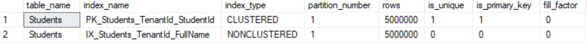
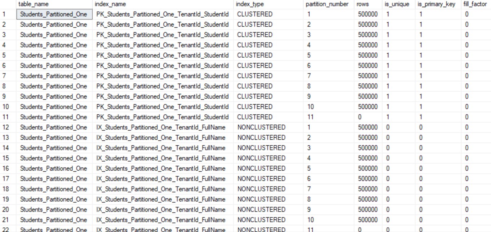
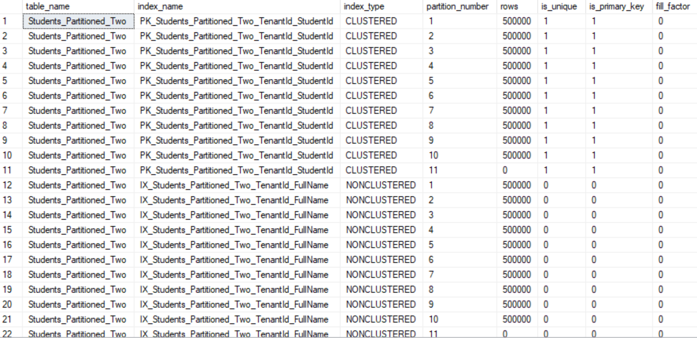

# Particionamento por tenant / client

- [Cenários](#cenários)
- [Preparando o ambiente](#preparando-o-ambiente)
- [Teste de busca de dados](#teste-de-busca-de-dados)
- [Comparação entre cenários](#comparação-entre-cenários)

## Cenários

Estamos simulando uma **Plataforma Educacional** que permite o cadastro de alunos, cursos, professores, boletins entre outras coisas. Esta é uma plataforma SaaS multi-tenant comportando milhares de instituições.

Todas, ou a maioria, das buscas na base de dados utilizam o escopo de tenant (filtrando por **tenant_id**).

| Cenário | Características | Índices |
| ------- | --------------- | ------- |
| 0 | Índices não particionados | PK_Vendas_Id (Clustered, Unique) e IX_Vendas_Created_At (Non-Clustered, Non-Unique) |
| 1 | Índices particionados com controle de partition do lado da aplicação | PK_Students_Partitioned_One_TenantId_StudentId (Clustered, Unique) e IX_Students_Partitioned_One_TenantId_FullName(Non-Clustered, Non-Unique) |
| 2 | Índices particionados sem precisar se preocupar com campo extra de partition | PK_Students_Partitioned_Two_TenantId_StudentId (Clustered, Unique) e IX_Students_Partitioned_Two_TenantId_FullName (Non-Clustered, Non-Unique) |

## Preparando o ambiente

```sql
CREATE DATABASE [SistemaEducativo];
GO
```

Imagine que uma das maiores tabelas do sistema é a tabela de `Students`. Neste sistema Multi-Tenant simulamos 100 Instituições com uma média de 50.000 alunos cada. Nos dando uma média de 5.000.000 de linhas na tabela `Students`.


### Cenário 0
Inicialmente criamos uma tabela chamada **Students** não particionada. Nesse exemplo, estamos simulando uma PK pelos campos tenant_id e student_id e um índice NONCLUSTERED auxiliar possibilitando o filtro pelo tenant_id e full_name (ambos índices comportando as buscas mais comuns do sistema).

**Passos**:
- Criar a tabela: [ddl.sql](./scenario_0/ddl.sql)

- Inserir massa de dados: Inserir 5.000 alunos para cada tenant (tendo 100 tenants), nos dando um total de 500.000 registros na tabela: [load.sql](./scenario_0/load.sql)

Como estamos criando os índices sem particionamento, todos os registros são salvos em uma única estrutura binário, uma única partição: [partitions.sql](./scenario_0/partitions.sql).



### Cenário 1
Nessa abordagem criamos os mesmos índices do cenário anterior, porém ambos particionados. O segredo aqui é a partition function criada por intervalo de tenant. Todos os tenants entre 1 e 10 cairão na primeira partição; os tenants entre 11 e 20 na segunda; e assim por diante conforme mostrado na tabela abaixo.

```sql
CREATE PARTITION FUNCTION [pf_TenantPartition_ByRange](INT)
AS RANGE LEFT FOR VALUES (10, 20, 30, 40, 50, 60, 70, 80, 90, 100)
```

| Partição | Intervalo de Tenants (INT) |
|----------|----------------------------|
| P1       | ≤ 10                       |
| P2       | 11–20                      |
| P3       | 21–30                      |
| P4       | 31–40                      |
| P5       | 41–50                      |
| P6       | 51–60                      |
| P7       | 61–70                      |
| P8       | 71–80                      |
| P9       | 81–90                      |
| P10      | 91–100                     |
| P11      | ≥ 101                      |

**Passos**:
- Criar a tabela: [ddl.sql](./scenario_1/ddl.sql)

- Inserir massa de dados: Inserir 5.000 alunos para cada tenant (tendo 100 tenants), nos dando um total de 500.000 registros na tabela: [load.sql](./scenario_1/load.sql)

Como estamos criando ambos índices particionados, vemos que cada partição recebeu o equivalente a 50.000 linhas (que representam os alunos): [partitions.sql](./scenario_1/partitions.sql).



### Cenário 2
Nessa abordagem criamos os mesmos índices de forma particionada semelhante ao Cenário 1. A diferença é que aqui temos um campo extra na tabela chamado `tenant_partition` (além do campo `tenant_id`). Neste cenário de exemplo, esse campo de `tenant_partition` varia de 0ae 9 e a sua função é distribuir os N tenants dentro de no máximo 10 partições. Isso quer dizer que indepedentemente da quantidade de tenants, eles serão distribuídos sempre em 10 partições.

```sql
CREATE PARTITION FUNCTION [pf_TenantPartition](INT)
AS RANGE LEFT FOR VALUES (0, 1, 2, 3, 4, 5, 6, 7, 8, 9)
```

Veja que nesse exemplo a aplicação tem duas formas de tratar isso:
- Podemos usar a função `ABS(CHECKSUM(tenant_id)) % 10` para que o próprio SQL Server gera um valor entre 0 e 9 baseado no tenant_id informado.
- Porém, também existe a opção da própria aplicação controlar e informar ao banco de dados em qual partição ela quer que aquele tenant seja salvo (exemplo, gerando um valor randômico entre 0 e 9).

No nosso exemplo, estamos usando a primeira opção por questão de simplicidade.

**Passos**:
- Criar a tabela: [ddl.sql](./scenario_2/ddl.sql)

- Inserir massa de dados: Inserir 5.000 alunos para cada tenant (tendo 100 tenants), nos dando um total de 500.000 registros na tabela: [load.sql](./scenario_2/load.sql)

Como estamos criando ambos índices particionados, vemos que cada partição recebeu o equivalente a 50.000 linhas (que representam os alunos): [partitions.sql](./scenario_2/partitions.sql).



## Teste de busca de dados
### Scenario 0

Com essa abordagem, quanto mais registros temos na tabela, mais os índices crescerão e mais custoso será para o banco de dados realizar operações de leitura.

Operações de index_seek nesses dados talvez não serão tão perceptíveis, pois o banco conseguirá obter os dados de forma eficiente na maioria das vezes. Porém, as operações de index scan podem ser bastante custosas.

**Operações eficientes**:
- tenant_id e client_id: INDEX SEEK pela PK em 1 registro

```sql
SELECT * FROM Students where tenant_id = 100 AND student_id = 20
```

- tenant_id e full_name: INDEX SEEK pelo NONCLUSTERED INDEX em 1 registro + KEY KOOKUP pela PK em 1 registro. *OBS: O key lookup será necessário somente se os campos da projection não estiverem incluídos no índice NONCLUSTERED*

```sql
SELECT * FROM Students WHERE tenant_id = 100 AND full_name = 'Aluno_20_Tenant_100'
```

**Operações que terão uma degradação na performance conforme a tabela crescer**:

- tenant_id: INDEX SEEK pela PK. Como a PK é por tenant_id e client_id, se o filtro for somente por tenant_id, o SQL Server terá de varrer todos os registros de um tenant_id (no nosso exemplo 50.000 registros).

```sql
SELECT * FROM Students WHERE tenant_id = 100 
```

> Essa operação usa índice, porém pode ser lenta dependendo da quantidade de registros para o tenant_id.

**Operações lentas**:
- full_name: INDEX SCAN pelo IX varrendo 500.000 registros + KEY LOOKUP pela PK em 1 registro (retorna só 1 registro)

```sql
SELECT * FROM Students WHERE full_name = 'Aluno_20_Tenant_100'
```

- student_id: INDEX SCAN pelo IX varrendo 500.000 linhas + KEY LOOKUP pela PK em 100 registros (retorna 100 registros)

```sql
SELECT * FROM Students WHERE student_id = 200
```

### Scenario 1

O plano de execução das queries no cenário de particionamento é praticamente o mesmo que no cenário sem particionamento. A grande diferença de ganho de performance está no uso menor de CPU e IO ao percorrer as estruturas bináries quando houver *partition elimination*.

Por outro lado, operações de scan em múltiplas partições pode ser mais lento do que em uma estrutura sem particionamento por conta do overhead de controle das partições.

**Operações eficientes**:
- tenant_id e client_id: INDEX SEEK pela PK em 1 registro acessando uma única partição.

```sql
SELECT * FROM Students_Partitioned_One where tenant_id = 100 AND student_id = 20
```

- tenant_id e full_name: INDEX SEEK pelo NONCLUSTERED INDEX em 1 registro + KEY KOOKUP pela PK em 1 registro - acessando uma única partição em ambos casos. *OBS: O key lookup será necessário somente se os campos da projection não estiverem incluídos no índice NONCLUSTERED*

```sql
SELECT * FROM Students_Partitioned_One WHERE tenant_id = 100 AND full_name = 'Aluno_20_Tenant_100'
```

> A performance das duas queries acima não teve muita diferença comparando com a tabela não particionada.

**Operações que terão uma degradação na performance conforme a tabela crescer**:

- tenant_id: INDEX SEEK pela PK acessando uma única partição. Como a PK é por tenant_id e client_id, se o filtro for somente por tenant_id, o SQL Server terá de varrer todos os registros de um tenant_id (no nosso exemplo 50.000 registros).

```sql
SELECT * FROM Students_Partitioned_One WHERE tenant_id = 100 
```

> Esta operação usa índice, contudo ela pode se tornar lenta a medida que a quantidade de Students para um mesmo tenant_id crescer. Apesar disso, como a estrutura desta tabela está particionando por tenant_id, o esforço para varrer esta árvore binário é menor em comparação com o cenário sem particionamento. Por conta disso, nesse exemplo, o `CPU cost` e `IO cost` é menor.


**Operações lentas**:
- full_name: INDEX SCAN pelo IX varrendo 500.000 registros em todas as partições + KEY LOOKUP pela PK em 1 registro (retorna só 1 registro)

```sql
SELECT * FROM Students_Partitioned_One WHERE full_name = 'Aluno_20_Tenant_100'
```

- student_id: INDEX SCAN pelo IX varrendo 500.000 linhas em todas as partições + KEY LOOKUP pela PK em 100 registros varrendo todas as partições (retorna 100 registros)

```sql
SELECT * FROM Students_Partitioned_One WHERE student_id = 200
```

> Nas duas queries acima, o cenário de particionamento é um pouco mais custoso que no ambiente não particionado. Isso se deve muito pelo fato de necessitar acessar todas as partições. Quando isso acontece à um custo extra no gerenciamento desses acessos multi partições.

### Scenario 2 
TO DO


## Comparação entre cenários

| Operação                                | Tabela Normal        | Tabela Particionada (`tenant_id`) | Vantagem Real |
|----------------------------------------|----------------------|-----------------------------------|----------------|
| `SELECT` com `tenant_id = X`           | Lê toda a tabela     | Eliminação de partição            | ✅ Sim         |
| `DELETE` com `tenant_id = X`           | Lê toda a tabela     | Eliminação de partição            | ✅ Sim         |
| `UPDATE` com `tenant_id = X`           | Lê toda a tabela     | Eliminação de partição            | ✅ Sim         |
| `SELECT` genérico (`LIKE '%X%'`)       | Lê toda a tabela     | Lê todas as partições             | ❌ Não         |
| `INSERT` (linha única)                 | Rápido               | Rápido (diferença mínima)         | ⚖️ Igual       |
| `ALTER INDEX REBUILD`                  | Lento (índice global)| Pode ser feito por partição       | ✅ Sim         |
| Arquivamento (`SWITCH PARTITION`)      | Complexo             | Rápido e simples                  | ✅ Sim         |


**Scenario 0 (Sem particionamento)**:
- Simplicidade na implementação.

- Recomendado em cenários em que o volume de dados ainda permite que as queries sejam eficientes, ou em cenários em que a busca sem o `tenant_id` é bastante comum.

- Também faz sentido utilizar a abordagem sem particionamento caso a tabela não seja muito utilizada nos fluxos críticos da aplicação (que demandam uma maior performance).

**Scenario 1**:
- O Partition Function por range pode ser útil quando você já tem uma quantidade grande de tenants em uma tabela não particionada e quer migrar esses dados para uma tabela particionada. Assim, você pode estimar de antemão qual é a melhor estratégia de range para que os dados fiquem uniformemente distribuído entre as partições. Isso permite, por exemplo, cadastrar os *outliers* - tenants que possuem uma quantidade muito acima de alunos - em um partição só para eles.

Exemplo onde 1001 e 1002 são *outliers*:

```sql
CREATE PARTITION FUNCTION pf_TenantRange(INT)
AS RANGE LEFT FOR VALUES (1000, 1001, 1002, 2000, 3000, 4000, 5000, 6000)
```

| Partição | Intervalo de Valores (INT) |
|----------|----------------------------|
| P1       | ≤ 1000                     |
| P2       | 1001                       |
| P3       | 1002                       |
| P4       | 1003 – 2000                |
| P5       | 2001 – 3000                |
| P6       | 3001 – 4000                |
| P7       | 4001 – 5000                |
| P8       | 5001 – 6000                |
| P9       | ≥ 6001

- A criação de novas partições não exige uma redistribição dos dados quando tivermos novos tenants usando a numeração incremental. Quando for adicionar uma nova partição entre 6000 e 7000 por exemplo.

- A aplicação não precisa controlar/conhecer nenhum campo extra. Somente com o campo `tenant_id` já é possível realizar o particionamento corretamente.

**Scenario 2**:
- **Cenário bom quando tivermos uma quantidade uniforme de alunos em cada tenant**: A distribuição de carga dos tenants será uniforme entre as partições. Isso pode ser útil no caso da quantidade de tenant ir aumentando aos poucos (começamos com poucos tenants e aumentando de forma orgânica). Isso acontece porque os primeiros 10 tenants serão distribuídos um em cada partição; os próximos 10 tenants também serão distribuídos um por partição; ou seja, a cada 10 novos tenants, eu terei uma quantidade igual de tenants em cada partição.

> Veja que embora a quantidade de tenants seja igual entre cada partição, a quantidade de alunos pode variar bastante.

- **Complexidade para aplicação**: A aplicação deve conhecer o `tenant_partition` de cada `tenant_id` e sempre passar ambos valores nas queries. Isso pode trazer uma complexidade a mais para a aplicação, porém em contrapartida traz um controle a mais, já que se torna mais fácil controlar outliers.

- **A expansão da quantidade de partições neste cenário não é tão simples**: precisaríamos mudar a estrutura da tabela criando um campo novo de CHECKSUM e possivelmente teríamos que mover dados entre as partições. Para reduzir a possibilidade desse problema, seria bom se tivessemos uma expectativa da quantidade máxima de tenants que vamos atingir antes de optar por essa estratégia. Isso auxilia na definição da quantidade de partições necessárias para manter uma boa performance da aplicação.


> **CUIDADOS COM AMBAS ABORDAGENS DE PARTICIONAMENTO**: Cada tenant terá uma quantidade X de alunos. Caso eu tenha muitos tenants grandes em uma mesma partição, a distribuição dos dados pode se tornar desigual. Nesse caso, no scenario 1 eu tenho a possibilidade de reorganizar o partition function / scheme e criar uma partição única para aquele tenant; Já no scenario 2, essa possibilidade somente existirá caso a aplicação controle em qual partition o tenant será salvo.
